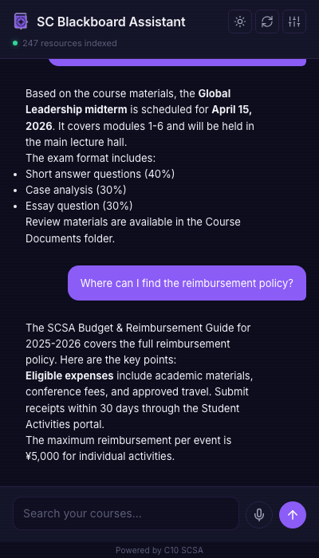
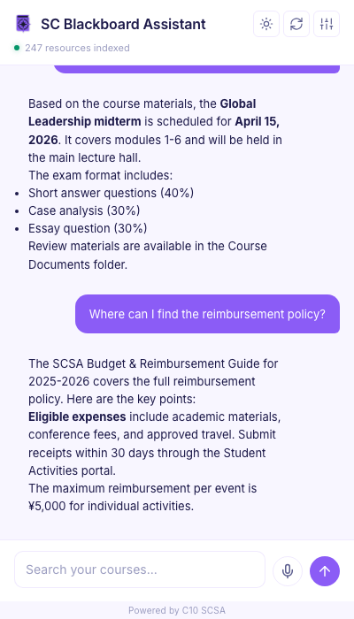
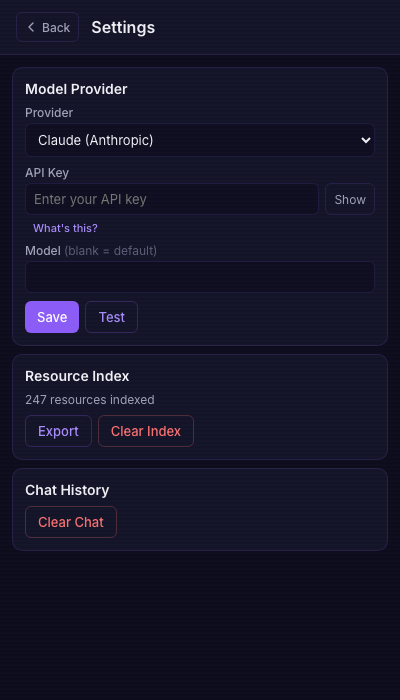

# SC Blackboard Assistant 🔍 — AI-powered search for your course materials


[](https://github.com/jingjing-yxng/blackboard-search)
[](https://developer.chrome.com/docs/extensions/mv3/)
[](https://opensource.org/licenses/MIT)

Natural language search and AI-powered Q&A across all your Blackboard LMS resources at Schwarzman College, Tsinghua University. Ask questions in plain English, get answers grounded in your actual course materials.

<p align="center">
  
  &nbsp;
  
  &nbsp;
  
</p>

## What it does

- **Crawls your Blackboard** — automatically indexes all pages, PDFs, documents, announcements, and course content across every course you're enrolled in (up to 5,000 pages)
- **Natural language search** — ask questions like "when is the midterm?" or "where's the reimbursement policy?" instead of clicking through folders
- **AI-powered answers** — uses RAG (retrieval-augmented generation) to give you accurate answers grounded in your actual course content, not hallucinated guesses
- **Smart intent detection** — understands whether you're asking about the academic calendar, class schedules, locations, faculty, or course content, and prioritizes results accordingly
- **Built-in knowledge base** — includes curated documents (e.g., SCSA budget guide) that are automatically surfaced when relevant
- **Multi-provider AI** — choose between Claude, OpenAI, or DeepSeek as your LLM backend

## Install

**[Install from Chrome Web Store](https://chromewebstore.google.com/detail/sc-blackboard-assistant/bcohnomkhpaneoehahiacdplpnnlnloa)**

Or load manually:
1. Clone this repo
2. Go to `chrome://extensions` → enable **Developer mode**
3. Click **Load unpacked** → select the `blackboard-search` folder
4. Navigate to any Blackboard page at `lms.sc.tsinghua.edu.cn`
5. Click the extension icon to open the side panel

## Setup

1. Open the side panel → **Settings**
2. Pick your AI provider:
   | Provider | Model | Notes |
   | --- | --- | --- |
   | **Claude** (Anthropic) | `claude-sonnet-4-20250514` | Best quality |
   | **OpenAI** | `gpt-4.1-mini` | Most popular |
   | **DeepSeek** | `deepseek-chat` | Budget friendly |
3. Paste your API key (stored locally in your browser — never sent to any server we operate)
4. Hit **Save & Test** to verify the connection

## How it works

```
Blackboard page → Content scraper extracts resources
                       ↓
              Service worker indexes locally
                       ↓
         User asks a question in the side panel
                       ↓
     Intent detector classifies query type
                       ↓
   Keyword extraction + expansion + semantic scoring
                       ↓
    Top results + knowledge base → LLM prompt (RAG)
                       ↓
         AI-grounded answer + ranked source links
```

1. **Scrape** — a content script runs on every Blackboard page, extracting links, files, announcements, breadcrumbs, and section context
2. **Crawl** — the crawler traverses your entire Blackboard site with smart rate limiting (150ms delay), deduplication, and URL normalization
3. **Index** — resources are stored locally in Chrome storage with metadata (title, URL, type, section, description)
4. **Search** — queries go through intent detection, keyword expansion (synonyms like "reimburse" → "reimbursement"), and weighted scoring (title > description > section)
5. **Answer** — top search results are injected into the LLM prompt as context, producing answers grounded in your actual course materials

## Features

- **Chat interface** with multi-turn conversation history
- **Voice input** via microphone button
- **Light/dark mode** with system preference detection
- **Export index** as JSON for backup
- **Streaming responses** with stop/abort support
- **Persistent settings** — theme, provider, API key, and chat history saved locally

## Privacy

All data stays on your device. No backend, no analytics, no tracking. Your API key and indexed content never leave your browser except to call your chosen AI provider directly. See [PRIVACY.md](PRIVACY.md) for details.

## Tech stack

- Chrome Extension (Manifest V3)
- Vanilla JavaScript — no build step, no dependencies (except pdf.js for PDF extraction)
- Chrome Side Panel API
- Chrome Storage API for local persistence
